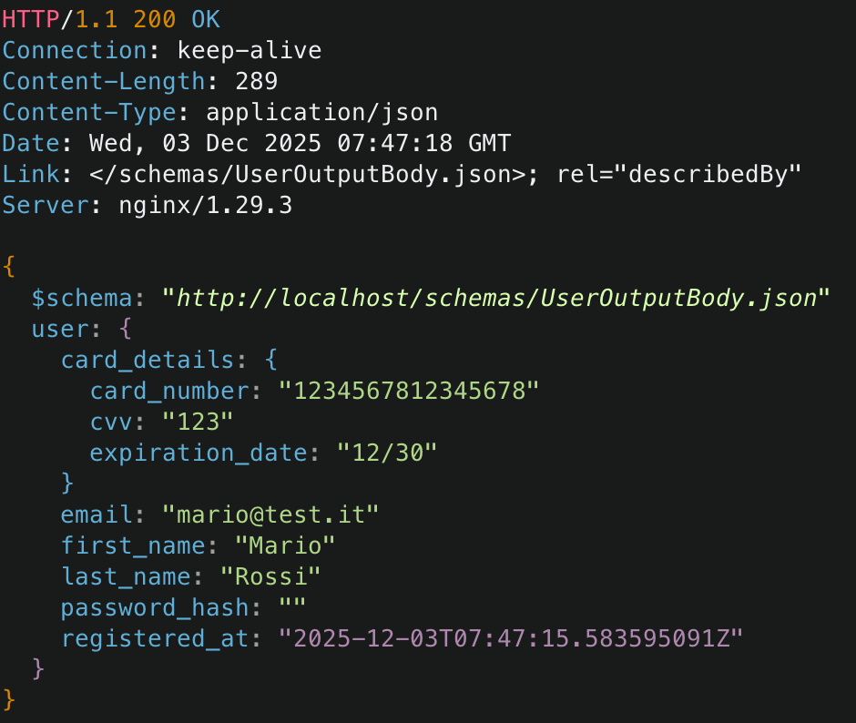
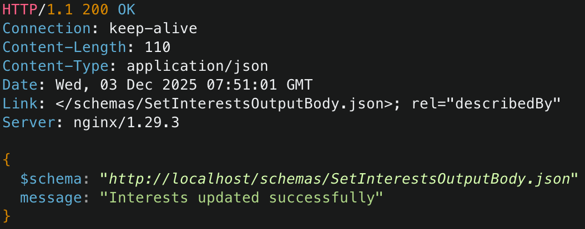

# Flight Data Manager - Distributed Microservices System


_Project for "Distributed Systems and Big Data" course of Computer Engineering_

_[Daniele Tambone](https://www.linkedin.com/in/daniele-tambone-b5733616a/) @ Dept of Math and Computer Science, University of Catania_

## Overview

**Flight Data Manager** is a robust distributed system designed to manage user subscriptions and monitor real-time flight data from OpenSky Network. The project demonstrates a **Microservices Architecture** built with **Go**, adhering to **Hexagonal Architecture (Ports & Adapters)** principles to ensure decoupling, testability, and scalability.

The system is composed of two main services:
1.  **User Manager:** Handles user identity, secure registration, and idempotency.
2.  **Data Collector:** Manages flight data collection, user interests, and statistical analysis.


## Architecture & Design Choices

The project implements advanced distributed systems patterns:

* **Hexagonal Architecture:** Both services separate Domain Logic (Core) from Infrastructure (Adapters) via Interfaces (Ports).
* **Inter-Service Communication:**
    * **gRPC:** Used for internal, high-performance synchronous communication (e.g., verifying user existence).
    * **REST API (Huma):** Used for external communication with clients.
* **Resiliency:**
    * **At-Most-Once Delivery:** Implemented in User Manager using a custom **Idempotency Key mechanism** (IP Hash + Request ID) backed by Redis.
    * **Fault Tolerance:** The Data Collector uses **Retry** and **Circuit Breaker** patterns when calling the User Manager.
* **Data Storage:**
    * **Redis:** Key-Value store for User profiles and Idempotency locks (Speed).
    * **Neo4j:** Graph database for modeling relationships (Users -> Interests -> Flights).
* **Security:**
    * **mTLS Ready:** Infrastructure code supports Mutual TLS for gRPC.
    * **Bcrypt:** Passwords are hashed before storage.
    * **Access Control:** Data access is guarded by cross-service credential verification.


## Getting Started

### 1. Prerequisites

  * **Docker** & **Docker Compose**
  * **Go 1.25+** (Optional, only for local development)
  * **Restish** (CLI for testing APIs):
  
**macOS:**
```bash
# Homebrew
brew tap danielgtaylor/restish
brew install restish

# Go (requires Go 1.18+)
go install [github.com/danielgtaylor/restish@latest](https://github.com/danielgtaylor/restish@latest)
```

**Linux:**
```bash
# Go (requires Go 1.18+)
go install [github.com/danielgtaylor/restish@latest](https://github.com/danielgtaylor/restish@latest)

# Homebrew for Linux
brew tap danielgtaylor/restish
brew install restish
```

**Windows:**
```bash
# Go (requires Go 1.18+)
go install [github.com/danielgtaylor/restish@latest](https://github.com/danielgtaylor/restish@latest)
```

### 2. Configuration (.env)

Create a `.env` file in the root directory. You can copy the example below:

```ini
# --- OPENSKY NETWORK (Required for Data Collector) ---
# Use your API Client credentials (recommended) or website login
OPENSKY_USER=your-client-id
OPENSKY_PASSWORD=your-client-secret

# --- NEO4J ---
NEO4J_USER=neo4j
NEO4J_PASSWORD=secret_password

# --- REDIS ---
REDIS_PASSWORD=
REDIS_DB=0
```

### 3. Generate Certificates (mTLS)

Before running, generate the TLS certificates for internal gRPC communication:

```bash
chmod +x pkg/scripts/gen_certs.sh
./pkg/scripts/gen_certs.sh
```

### 4. Run the System

Build and start all containers using Docker Compose:

```bash
docker-compose up --build
```

The system will be available via the **API Gateway (Nginx)** at `http://localhost:80`.

-----

## Testing the API

  * **User Manager Docs:** http://localhost/docs/user
  * **Data Collector Docs:** http://localhost/docs/data

### Quick Scenarios (using Restish)

#### 1. Register a User (Idempotent)

```bash
restish POST http://localhost/users \
  -H "Content-Type: application/json" \
  -H "X-Request-ID: 101" \
  '{
    "email": "mario@test.it",
    "password": "Password123!",
    "first_name": "Mario",
    "last_name": "Rossi",
    "card_number": "1234567812345678",
    "expiration_date": "12/30",
    "cvv": "123"
  }'
```



#### 2. Register Interest (requires User verification)

```bash
restish POST http://localhost/interests \
  -H "Content-Type: application/json" \
  '{
    "user_email": "mario@test.it",
    "password": "Password123!",
    "airport_codes": ["LICC", "LICJ"]
  }'
```



#### 3. Get Flight Data (after \~12h or forced restart)

```bash
restish GET 'http://localhost/airports/LIRF/flights?email=mario@test.it&password=Password123!&limit=5'
```

## Development & Debugging

  * **Redis CLI:** `docker exec -it redis redis-cli`
  * **Neo4j Cypher Shell:** `docker exec -it neo4j cypher-shell -u neo4j -p <password>`
  * **Forcing Data Collection:** The worker runs every 12h by default. To force an immediate run:
    `docker-compose restart data-collector`

> [!tip]
>
> If you prefer use Neo4j Browser, in neo4j service in docker-compose:
>
>  ```yaml
>  neo4j:
>  	...
>    #ports:
>    #  - "7474:7474" # Browser UI (http://localhost:7474)
>    #  - "7687:7687"
>    ...
>  ```
>
> Remove the comment.
>
> Now you can use Neo4j Browser in http://localhost:7474/browser/

## Future implementation
- JWT Authentication: Implement token-based auth to avoid sending credentials on every request to the Data Collector.
- Microservices Testing: Implement comprehensive unit and integration tests for each microservice.
- Observability: Add metrics and tracing for better system monitoring.
